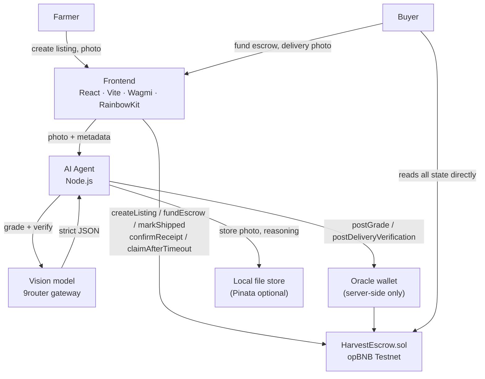

# Architecture

The smart contract never calls an AI API. An off-chain agent does the thinking; a dedicated oracle
wallet is the only address permitted to write results on-chain.

## Components

| Component | Tech | Path |
| --- | --- | --- |
| Smart contract | Solidity 0.8.28, Foundry, OpenZeppelin | `contract/src/HarvestEscrow.sol` |
| AI agent | Node.js, Viem, HTTP API on `:8787` | `agent/` |
| Frontend | React 19, Vite, Wagmi v2, RainbowKit | `frontend/` |
| AI provider | 9router gateway, `thirty/` vision models | `agent/src/ai/glm.js` |
| Storage | Local file store by default, IPFS via Pinata | `agent/src/ipfs/pinata.js` |

## Agent HTTP API

| Route | Purpose |
| --- | --- |
| `GET /api/health` | service + contract status |
| `POST /api/upload` | store the harvest photo, return `{ photoURI, hashHex }` |
| `POST /api/grade` | stage 1 grading, posts on-chain if confident |
| `POST /api/verify-delivery` | stage 2 comparison, posts on-chain if confident |
| `GET /api/photo` | serve a locally-stored photo |

## On-chain data per listing

`farmer`, `buyer`, `cropType`, `weightKg`, `priceWei`, `photoHash`, `photoURI`, `grade`,
`gradeReasonURI`, `gradeConfidence`, `deliveryVerified`, `deliveryMatched`, `deliveryReasonURI`,
`deliveryConfidence`, `status`, `deliveryDeadline`.
