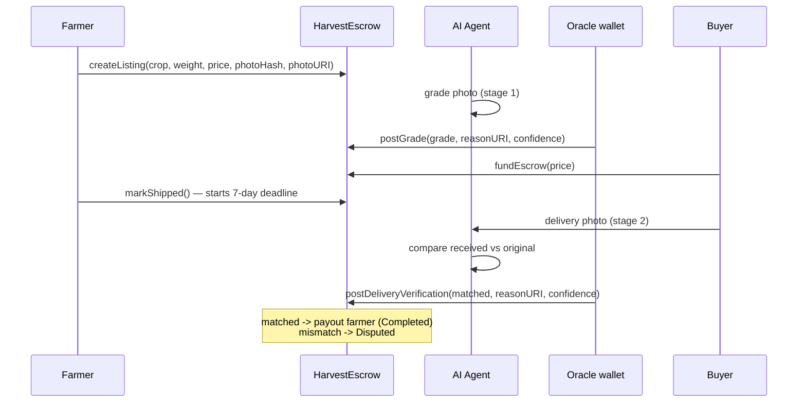

# How it works

FHIN FARM runs **two independent AI verifications**, each posted on-chain as a separate transaction.
They are never collapsed into one call.

## Stage 1 — harvest grading

The farmer creates a listing with a crop type, weight, price, a photo hash, and a photo URI. An
off-chain agent inspects the photo and returns:

```json
{ "grade": "A", "confidence": 92, "reasons": ["..."] }
```

The grade is `A`, `B`, or `C`. Confidence is an integer from 0 to 100. If confidence is **below the
threshold** (`MIN_CONFIDENCE`, default 70), the agent posts **nothing** on-chain and logs
`MANUAL_REVIEW` instead. The grade is then immutable: `postGrade` requires the listing to still be
`Created`.

## Stage 2 — delivery verification

When the goods arrive, the buyer uploads a photo of what they received. The agent compares it
against the photo that was graded at the start — not against a fresh standard — and returns:

```json
{ "matched": true, "confidence": 98, "differences": [] }
```

Escrow follows that result:

* `matched: true` → payment released to the farmer, status `Completed`.
* `matched: false` → funds stay locked, status `Disputed`, owner resolves.

## The oracle boundary

The smart contract **does not call an AI**. It trusts a single oracle address. Change the model,
change the prompt, replace the whole agent — the on-chain logic does not move. Only the oracle
address can write results, enforced by the `onlyOracle` modifier.



## Listing lifecycle

```
Created ──[stage 1 grade]──> Graded ──[fundEscrow]──> Funded ──[markShipped]──> Shipped
Shipped ──[stage 2: match]──> Completed   (funds released)
Shipped ──[stage 2: mismatch]──> Disputed (funds locked)
Shipped ──[confirmReceipt]──> Completed   (buyer releases early)
Shipped ──[claimAfterTimeout]──> Completed (farmer, after 7 days)
Disputed ──[resolveDispute]──> Completed  (owner decides)
```
